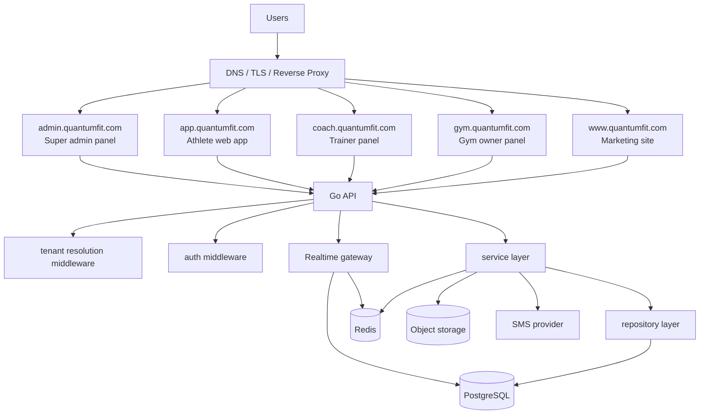

# QuantumFit Web Platform Architecture

This document defines the target production architecture for the QuantumFit Web Platform:

- `www.quantumfit.com` marketing website
- `gym.quantumfit.com` gym owner panel
- `coach.quantumfit.com` trainer panel
- `app.quantumfit.com` athlete web app
- `admin.quantumfit.com` super admin panel

The stack is intentionally simple:

- Frontend: Next.js (React), App Router, shared component packages
- Backend: Go, clean architecture, REST APIs
- Database: PostgreSQL
- Cache and hot state: Redis

No long build pipeline, no unnecessary service sprawl, and strict tenant isolation from day one.

---

## 1. Executive Summary

QuantumFit is a multi-gym web platform where each gym is a tenant. The system must keep every tenant isolated while still supporting shared platform operations such as pricing, coupons, onboarding, analytics, and admin control.

Recommended shape:

- one Go backend API
- five Next.js frontends deployed by subdomain
- one PostgreSQL cluster with a hybrid tenant model
- Redis for cache, live counters, and short-lived coordination
- optional async worker process for analytics and notifications

The backend should start as a modular monolith. That keeps setup simple and runnable, while still leaving clean seams for future extraction if traffic grows.

---

## 2. Full System Architecture



Request flow:

1. Browser hits the subdomain.
2. Frontend loads the correct app shell.
3. App calls the Go API.
4. Middleware resolves subdomain, tenant, role, and session.
5. Service layer executes a tenant-scoped use case.
6. Repository layer only runs tenant-aware queries.
7. PostgreSQL stores source-of-truth data.
8. Redis serves hot dashboard data and live counters.

---

## 3. Multi-Tenant Model

### Decision

Use a **hybrid shared-schema model**:

- one shared PostgreSQL database for most gyms
- every tenant-owned row includes `tenant_id`
- row-level security on critical tables
- table partitioning for high-volume event data
- optional dedicated database for exceptional enterprise gyms

### Why this model

- supports 10,000+ gyms without exploding operations
- keeps setup simple and runnable
- makes migrations manageable
- provides a clean path for heavy tenants
- allows strong isolation without per-gym database overhead

### Tenant separation rules

- every tenant-owned query must include tenant context
- every tenant-owned table must include `tenant_id`
- every foreign key between tenant-owned rows must preserve tenant scope
- every repository method must accept tenant context explicitly
- every admin-only cross-tenant query must go through separate guarded repositories

### Tenant detection middleware

Tenant resolution is based on the request host:

- `gym.quantumfit.com` -> gym owner panel context
- `coach.quantumfit.com` -> trainer panel context
- `app.quantumfit.com` -> athlete context
- `admin.quantumfit.com` -> super admin context
- custom tenant domains can be mapped later if needed

Middleware responsibilities:

- read `Host`
- resolve platform panel or tenant domain
- load tenant metadata
- attach `TenantContext`
- reject unknown or disabled domains
- set DB session tenant variable for RLS

### Secure query handling

Rules for repositories:

- no raw tenantless `List` or `Get` methods
- every query uses `tenant_id` and ideally request-scoped session data
- joins must match both logical ID and tenant ID
- super admin reporting queries stay in dedicated admin repositories

Database defense-in-depth:

- application-layer tenant context
- repository-layer tenant scoping
- PostgreSQL row-level security
- audit logging for cross-tenant admin access

---

## 4. System Bootstrap Flow

### Step 1: Super admin creates a gym

Super admin can:

- create gym account
- assign username and password
- choose a subscription plan
- generate a subdomain automatically
- mark onboarding as pending

Suggested onboarding state:

- `created`
- `invite_sent`
- `first_login_pending`
- `onboarding_in_progress`
- `active`
- `suspended`

### Step 2: First login onboarding wizard

On first login the gym owner must finish a multi-step wizard:

- gym name
- gym type: male / female / mixed
- location
- size in square meters
- logo upload
- images upload
- contact info
- working hours
- equipment list
- trainer count

After the wizard completes:

- gym profile becomes active
- subdomain is enabled
- dashboard data is unlocked
- onboarding state becomes `active`

### Onboarding rule

Until onboarding completes, the gym panel should only expose:

- profile setup
- password change
- support contact
- limited status page

No operational data should be visible before activation.

---

## 5. Authentication and Authorization

### Authentication model

- JWT access token
- refresh token rotation
- hashed refresh token storage
- short-lived access token
- tenant-aware session binding

### Roles

- super admin
- gym owner
- trainer
- athlete

### Claims

Recommended JWT claims:

```json
{
  "sub": "user_id",
  "tid": "tenant_id",
  "role": "gym_owner",
  "panel": "gym",
  "sid": "session_id",
  "aud": "quantumfit-web",
  "iss": "quantumfit-auth",
  "iat": 1710000000,
  "exp": 1710000900
}
```

### Resolution order

1. resolve host and panel
2. validate access token
3. confirm token tenant matches resolved tenant
4. check role and permissions
5. attach tenant context to request

### Authorization rules

- super admin can access cross-tenant admin endpoints
- gym owner can access all tenant data for their gym only
- trainer can access only assigned members and trainer-scoped resources
- athlete can access only personal profile, attendance, and assigned plans

---

## 6. Database Design

### Core tables

#### `gyms`

- `id` UUID or ULID
- `slug`
- `name`
- `status`
- `plan_id`
- `subdomain`
- `timezone`
- `tenant_type`
- `created_at`
- `updated_at`

#### `users`

- `id`
- `email`
- `phone`
- `password_hash`
- `status`
- `last_login_at`
- `created_at`
- `updated_at`

#### `gym_users`

- `id`
- `tenant_id`
- `user_id`
- `role`
- `status`
- `first_login_completed_at`
- `created_at`

#### `members`

- `id`
- `tenant_id`
- `full_name`
- `phone`
- `gender`
- `status`
- `joined_at`
- `created_at`
- `updated_at`

#### `trainers`

- `id`
- `tenant_id`
- `user_id`
- `full_name`
- `specialty`
- `status`
- `created_at`
- `updated_at`

#### `attendance_logs`

- `id`
- `tenant_id`
- `member_id`
- `trainer_id`
- `checkin_at`
- `checkout_at`
- `source`
- `created_at`

#### `subscriptions`

- `id`
- `tenant_id`
- `plan_id`
- `status`
- `starts_at`
- `ends_at`
- `billing_cycle`
- `created_at`

#### `onboarding_state`

- `id`
- `tenant_id`
- `step`
- `payload` JSONB
- `completed_at`
- `created_at`
- `updated_at`

#### `equipment`

- `id`
- `tenant_id`
- `name`
- `category`
- `quantity`
- `status`
- `last_maintenance_at`
- `created_at`
- `updated_at`

#### `analytics_events`

- `id`
- `tenant_id`
- `event_type`
- `entity_type`
- `entity_id`
- `payload` JSONB
- `occurred_at`
- `created_at`

### Platform tables

#### `pricing_plans`

- `id`
- `code`
- `name`
- `limits`
- `is_active`
- `created_at`

#### `coupons`

- `id`
- `code`
- `discount_type`
- `discount_value`
- `starts_at`
- `ends_at`
- `is_active`

#### `tenant_domains`

- `id`
- `tenant_id`
- `subdomain`
- `custom_domain`
- `panel_type`
- `is_active`

### High-volume table strategy

Tables that will grow quickly:

- `attendance_logs`
- `analytics_events`
- `sms_logs`
- `occupancy_snapshots`

Recommended treatment:

- monthly partitioning by time
- composite indexes with `tenant_id`
- optional tenant-based subpartitioning for large gyms

### Important indexes

- `gyms (slug)`
- `tenant_domains (subdomain)`
- `users (email)`
- `gym_users (tenant_id, user_id)`
- `members (tenant_id, phone)`
- `members (tenant_id, status)`
- `attendance_logs (tenant_id, checkin_at desc)`
- `attendance_logs (tenant_id, member_id, checkin_at desc)`
- `equipment (tenant_id, status)`
- `analytics_events (tenant_id, occurred_at desc)`

### Isolation constraints

- unique `tenant_id + external_ref` where external mapping exists
- foreign keys must include tenant safety checks in application logic
- row-level security for all tenant-owned tables
- admin audit tables separated from operational tenant tables

---

## 7. Database Isolation Strategy

### Preferred approach

Use shared schema with strict tenant IDs.

### Guardrails

- every request gets a `TenantContext`
- every SQL query is tenant-scoped
- repositories refuse tenantless access for tenant-owned data
- RLS blocks cross-tenant reads and writes
- admin queries are explicitly separated

### When to isolate a gym further

Move a gym to dedicated infrastructure only when:

- a contract requires it
- traffic is unusually high
- retention or compliance needs are special
- shared storage starts impacting the platform

---

## 8. Backend Structure in Go

Recommended folder layout:

```text
backend/
  cmd/
    api/
      main.go
  internal/
    bootstrap/
      container.go
    config/
      config.go
    domain/
      auth/
      tenant/
      gym/
      user/
      member/
      trainer/
      attendance/
      subscription/
      onboarding/
      equipment/
      analytics/
    app/
      auth/
      tenants/
      gyms/
      members/
      trainers/
      attendance/
      subscriptions/
      onboarding/
      equipment/
      analytics/
      notifications/
    transport/
      httpapi/
        router.go
        middleware/
        handlers/
        dto/
        presenters/
      sse/
      websocket/
    infrastructure/
      db/
      cache/
      storage/
      queue/
      sms/
      observability/
    platform/
      tenantresolver/
      security/
      requestcontext/
```

### Layer rules

- `domain`: pure business entities and invariants
- `app`: use cases and orchestration
- `transport`: HTTP, SSE, WebSocket, request/response DTOs
- `infrastructure`: Postgres, Redis, object storage, SMS, queue adapters
- `platform`: cross-cutting concerns like tenant resolution and security

### Current repo mapping

The current Go scaffold already has the right direction:

- `internal/bootstrap`
- `internal/config`
- `internal/domain`
- `internal/app`
- `internal/transport/httpapi`
- `internal/server`

Next work should extend that scaffold with tenant, auth, persistence, and middleware packages instead of flattening the codebase.

---

## 9. Frontend Structure in Next.js

Use one Next.js app per public subdomain.

### Suggested workspace layout

```text
frontend/
  apps/
    www/
      app/
      public/
    gym/
      app/
      public/
    coach/
      app/
      public/
    athlete/
      app/
      public/
    admin/
      app/
      public/
  packages/
    ui/
    api-client/
    config/
    auth/
    i18n/
    theme/
```

### Frontend rules

- use App Router
- use shared component library
- keep API access in a shared client package
- enable RTL for Persian
- support `fa` and `en`
- use premium dark UI tokens
- keep each subdomain app separately deployable

### UI direction

- ultra-dark dashboard surfaces
- glassmorphism panels
- neon emerald accents
- purple highlights
- strong spacing rhythm
- high-end charts and data visualization

### Fonts

- English: Inter
- Persian: Vazirmatn or IRANSansX

### Shared frontend capabilities

- auth guards
- tenant-aware navigation
- locale switching
- shared forms and tables
- shared dashboard cards
- chart primitives

---

## 10. Real-Time and Performance Design

### Core needs

- real-time occupancy
- live attendance updates
- dashboard metrics
- notification fan-out

### Recommended flow

1. check-in request enters API
2. request validates tenant and membership
3. attendance row is written to PostgreSQL
4. event is published to Redis stream or queue
5. occupancy projection is updated
6. dashboard receives a live update through SSE or WebSocket

### Performance techniques

- Redis for hot counters and fast dashboard reads
- partitioned event tables
- tenant-aware indexes
- read models for dashboards
- async analytics projections

### Scale target

This design is comfortable for:

- 10,000+ gyms
- millions of attendance records
- heavy dashboard traffic
- frequent live updates

---

## 11. API Structure

### REST base

All APIs are versioned:

- `/api/v1/...`

### Auth

- `POST /api/v1/auth/login`
- `POST /api/v1/auth/refresh`
- `POST /api/v1/auth/logout`
- `GET /api/v1/auth/me`

### Gym onboarding

- `GET /api/v1/onboarding/state`
- `POST /api/v1/onboarding/step`
- `POST /api/v1/onboarding/complete`

### Gyms

- `POST /api/v1/admin/gyms`
- `GET /api/v1/admin/gyms`
- `GET /api/v1/admin/gyms/{gymId}`
- `PATCH /api/v1/admin/gyms/{gymId}`
- `DELETE /api/v1/admin/gyms/{gymId}`

### Members

- `GET /api/v1/members`
- `POST /api/v1/members`
- `GET /api/v1/members/{memberId}`
- `PATCH /api/v1/members/{memberId}`

### Trainers

- `GET /api/v1/trainers`
- `POST /api/v1/trainers`
- `GET /api/v1/trainers/{trainerId}`
- `PATCH /api/v1/trainers/{trainerId}`

### Attendance and occupancy

- `POST /api/v1/attendance/checkin`
- `POST /api/v1/attendance/checkout`
- `GET /api/v1/attendance`
- `GET /api/v1/occupancy/current`
- `GET /api/v1/occupancy/history`

### Subscriptions and pricing

- `GET /api/v1/admin/plans`
- `POST /api/v1/admin/plans`
- `GET /api/v1/admin/coupons`
- `POST /api/v1/admin/coupons`
- `GET /api/v1/gym/subscription`

### Analytics

- `GET /api/v1/analytics/dashboard`
- `GET /api/v1/analytics/attendance`
- `GET /api/v1/analytics/members`

### Admin operations

- `GET /api/v1/admin/metrics`
- `GET /api/v1/admin/audit-log`
- `GET /api/v1/admin/system-health`

### API conventions

- paginate list endpoints
- use opaque IDs
- return idempotency keys for write-heavy endpoints
- keep admin endpoints clearly separated
- never expose cross-tenant data in tenant-scoped routes

---

## 12. Authentication Flow Diagram

```text
1. User opens the correct subdomain
2. Next.js app loads and requests session state
3. Browser sends JWT access token
4. API middleware resolves host -> panel -> tenant
5. Auth middleware validates JWT
6. Middleware checks token tenant against resolved tenant
7. Role and permission checks run
8. Request gets TenantContext and UserContext
9. Handler calls service layer
10. Repository executes tenant-scoped query
11. Response returns only authorized data
```

Short version:

```text
host -> tenant resolution -> JWT validation -> role check -> tenant-scoped use case -> response
```

---

## 13. Super Admin Panel

Must support:

- create gyms
- delete gyms
- manage subscriptions
- manage pricing plans
- manage coupons
- view platform analytics
- audit cross-tenant actions

Super admin data should live behind dedicated APIs and audit logs so platform control stays separate from tenant operations.

---

## 14. Gym Panel

Must support:

- real-time occupancy
- member management
- trainer management
- attendance tracking
- SMS automation
- analytics dashboard
- equipment tracking
- subscription management

Gym dashboard data should mostly come from:

- PostgreSQL for source of truth
- Redis for hot counters
- async rollups for charts

---

## 15. Marketing Website

Must support:

- landing page
- pricing page
- feature explanation
- gym onboarding CTA
- login redirect system

All marketing content should be managed from admin-configured data so pricing and feature copy remain dynamic.

---

## 16. Production Notes

### Keep setup simple

- single backend binary
- single PostgreSQL cluster
- single Redis cluster
- separate Next.js frontends by subdomain
- one workspace for shared frontend packages

### Observability

- structured logs
- request IDs
- tenant IDs in logs
- audit trails for admin activity
- dashboard metrics for DB/cache/API latency

### Future AI readiness

Keep event history and operational telemetry in a format that can later feed:

- retention predictions
- occupancy forecasting
- member engagement analysis
- trainer performance insights

---

## 17. Recommended Next Implementation Step

The current repository should be migrated in this order:

1. lock in tenant and auth contracts in Go
2. scaffold PostgreSQL models and migrations
3. replace Vite app shells with Next.js App Router apps
4. build shared UI and API client packages
5. add onboarding, login, and tenant-aware middleware

That sequence keeps the platform runnable early while protecting the multi-tenant boundary from the start.
